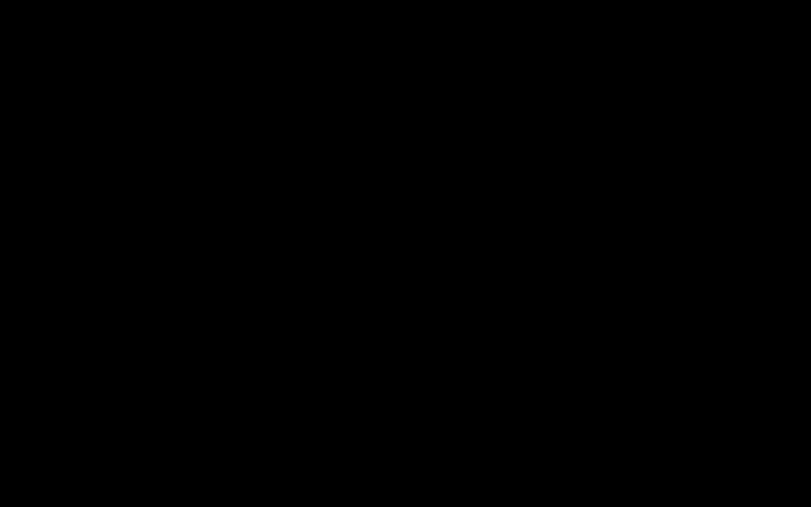

# Untitled Level

---

## Level Statistics

| Stat | Value |
|------|-------|
| **Total Objects** | 26 |
| **Starting Speed** | Half |
| **Starting Gamemode** | Cube |
| **Starting Size** | Normal |

## Dimensions

| Metric | Value |
|--------|-------|
| **Length** | 18 blocks) |
| **Height** | 105 units |
| **X Range** | 75 to 555 |

## Object Breakdown

| Category | Count | % |
|----------|------:|--:|
| Blocks | 26 | 100.0% |

## Advanced

| Detail | Value |
|--------|-------|
| **Trigger Count** | 0 |
| **Groups Used** | 0 |
| **Raw Level Size** | 1.6 KB |

---
*Managed by GDGit*
